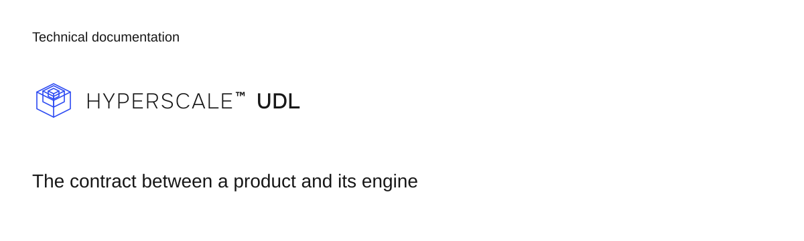

# UDL

UDL is the Universal Domain Language, the canonical JSON contract for a financial product. One `.udl` file declares subjects, instruments, lifecycles, actions, and money movement. An engine admits that document without reading the source language that produced it. UDL keeps provider machinery below the format: it has no file drops, polling loops, cutoff jobs, scheme messages, or provider statement schemas. The `reconcile` clause names settlement evidence against a declared provider-side row; it does not model provider transport or matching machinery.

## Install

```bash
npm install @hyperscale0/udl
```

This package contains the parser, semantic validator, canonical serializer, append-only evolution diff, JSON Schema, and conformance corpus.

## First document

Save this document as `note.udl`:

```json
{
  "instruments": [
    {
      "actionOrder": ["close", "create"],
      "fields": { "reference": { "type": "string" } },
      "id": "note",
      "idPrefix": "note",
      "lifecycle": {
        "initial": "open",
        "states": ["open", "closed"],
        "transitions": { "close": { "from": ["open"], "to": "closed" } }
      },
      "required": ["reference"],
      "summary": "A note a tenant files and later closes.",
      "title": "Note",
      "actions": {
        "close": { "moves": [], "steps": [], "summary": "Close the note." },
        "create": { "moves": [], "steps": [], "summary": "File the note." }
      }
    }
  ],
  "product": "minimal",
  "subjects": [],
  "title": "Minimal",
  "udl": 1,
  "version": 1
}
```

Check the document with the CLI:

```bash
npx udl validate note.udl
npx udl fmt note.udl --write
npx udl canon note.udl --digest
```

Exit code `0` means success. Exit code `1` means the validator refused the document. Exit code `2` means the invocation or file read failed.

In TypeScript, parse, validate, and compare documents directly:

```ts
import { readFile, writeFile } from "node:fs/promises";
import {
  canonicalDigest,
  diffValidatedUdlEvolution,
  parseUdl,
  serializeUdl,
  validateUdl,
} from "@hyperscale0/udl";

const document = parseUdl(await readFile("note.udl"));
await writeFile("note.udl", serializeUdl(document));
console.log(await canonicalDigest(document));

const result = validateUdl(document);
if (!result.ok) console.error(result.issues);

const previous = parseUdl(await readFile("note.previous.udl"));
const violations = diffValidatedUdlEvolution(previous, document);
```

The evolution diff API (`diffValidatedUdlEvolution`, `diffInstrumentEvolution`, and `npx udl diff`) verifies that changes between two product versions are append-only. Adding optional fields, states, transitions, and actions is permitted; removing, renaming, or tightening existing structures returns `UDL7xxx` violation issues.

## Documentation

- [Guide and reading order](docs/README.md)
- [Format specification](spec/README.md)
- [Canonical bytes law](docs/reference/canonical.md)
- [Stable diagnostics](docs/reference/diagnostics.md)
- [Conformance suite](conformance/README.md)
- [Agent skill](skills/udl/SKILL.md)
- [Contributing](CONTRIBUTING.md)

## License and security

UDL is licensed under AGPL-3.0-only, with a commercial license available from Hyperscale LLC. See [LICENSE](LICENSE), [LICENSING.md](LICENSING.md), and [TRADEMARKS.md](TRADEMARKS.md).

Vulnerability reports go through private disclosure as described in [SECURITY.md](SECURITY.md).
